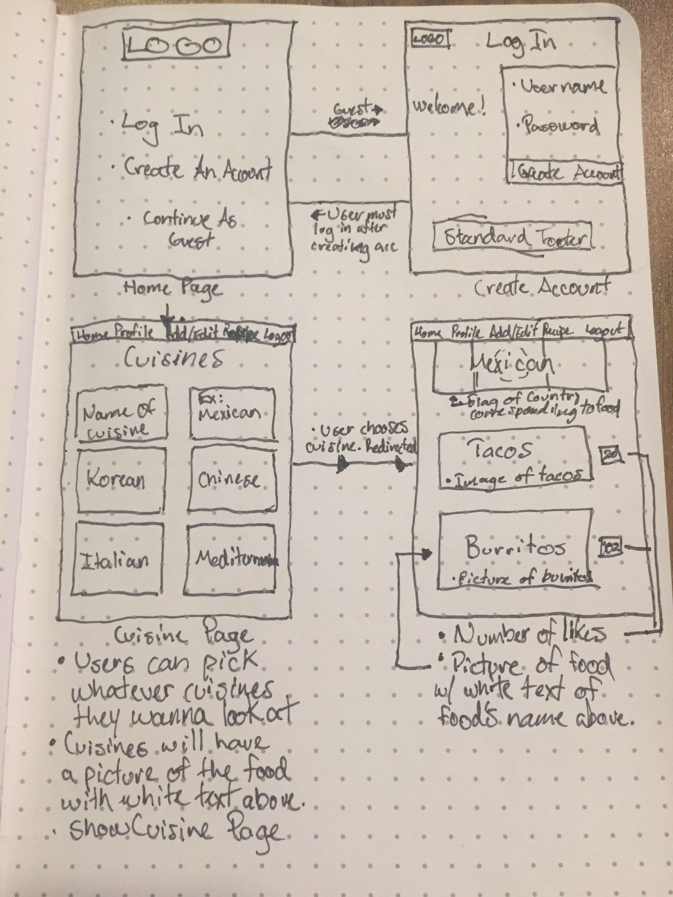
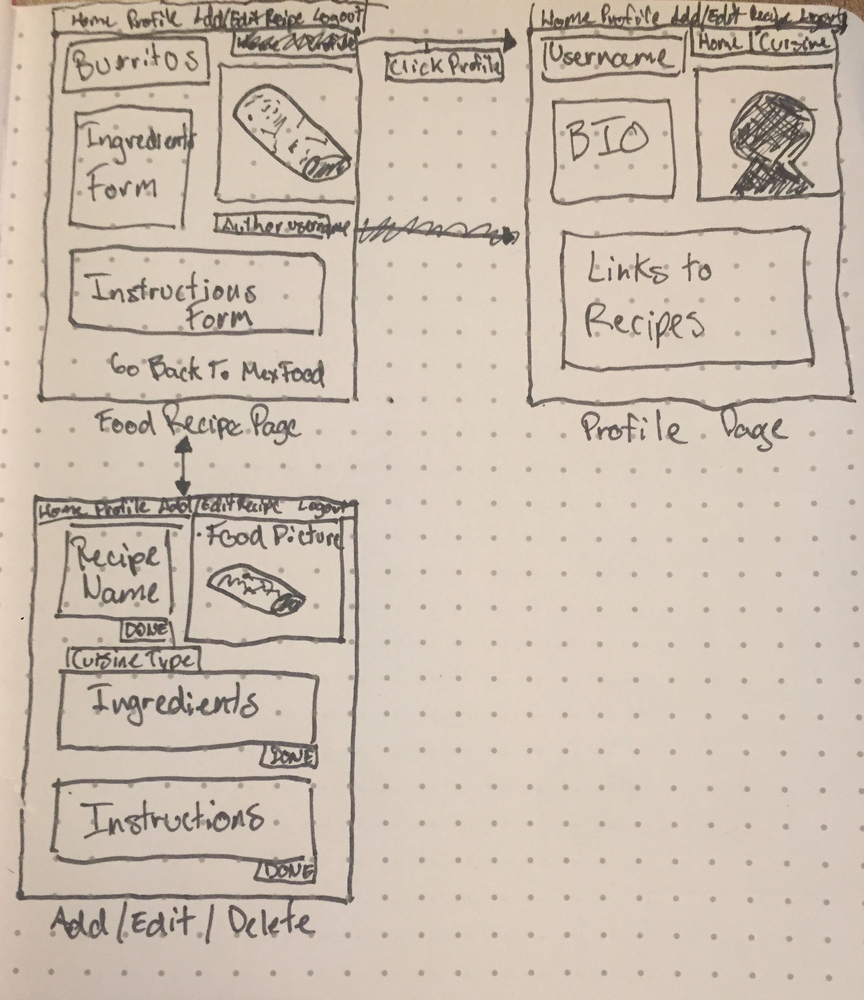

# The-Roasted-Mongoose

# Recipes Full Stack Applicaton

# MVP

  - Users can browse recipes by cuisine.

  - Users can register and log in

  - Guest users can only view recipes.

  - Logged in users will have a profile page.

  - Logged in users profile page will show all the recipes they added.

  - Only Logged in Users can add, edit, and delete recipes.

  	
# Stretch Goals

 - Users Can Search Site for recipes.

    - Profile pages of logged in users will have :

    - Profile Picture

    - Bio

    - Show a list of Favorited recipes

  - Logged in users can favorite recipes

  - There will be a chef or user log in.
  
  - Chef will have more options and accessibility to the website than users.

  - All users can like and dislike recipes, show most liked recipes.

  - Cuisines will be displayed on the page depending likes/dislikes.

  - Favorites list will be displayed on logged in users “show”page

  - Users can search or sort by food type

  - Users can comment on recipes

  - Users can search their location for food of that type of cuisine.

  - User can sign up for a subscription to have access to videos of recipes

  - Users can look up other authors on the website

# Wire Frame:

 

